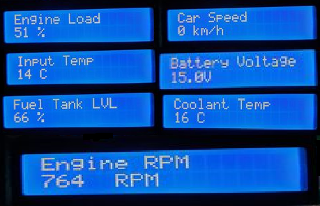
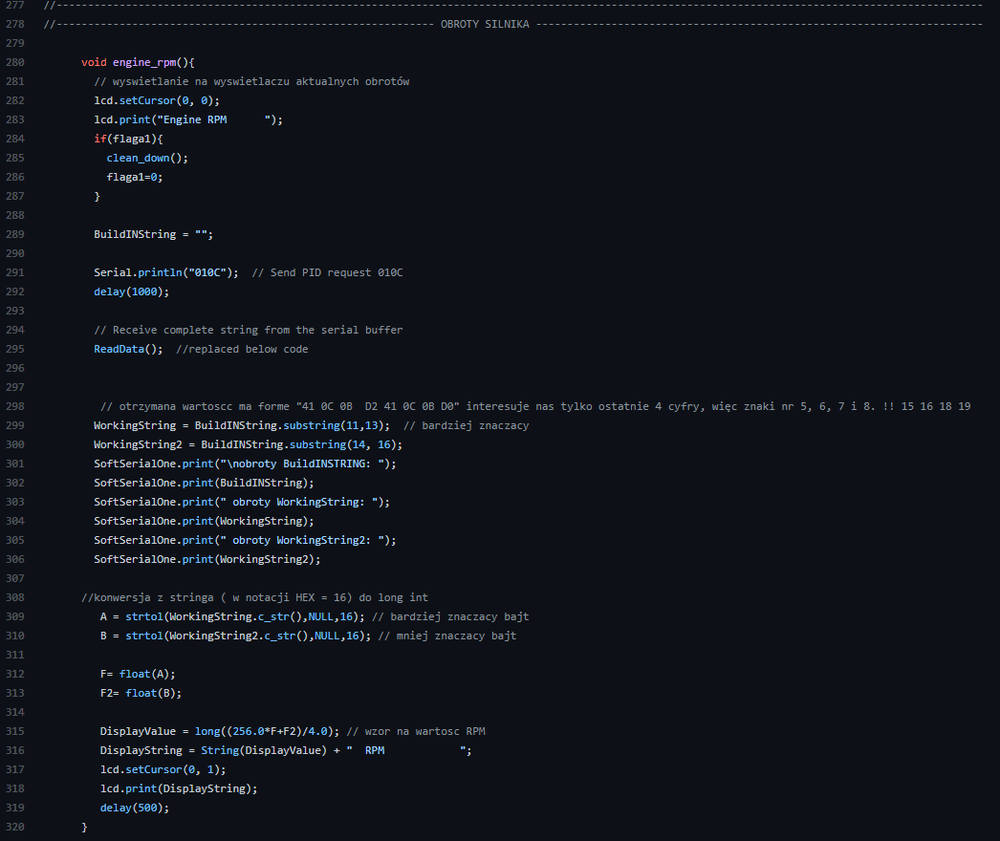

# ELM327 & HC-05
>The aim of this project was to read data from any car`s CAN bus using OBDII, and display it on LCD with possibly low delay.

## Table of contents
* [General info](#general-info)
* [Screenshots](#screenshots)
* [Technologies](#technologies)
* [Features](#features)
* [Status](#status)
* [Contact](#contact)

## General info
Older cars that support OBDII standard have a lot of data about current car condition which aren't shown to us, but we can read them all and display the ones that interest us.

## Screenshots

## Technologies
C,
Arduino IDE,
Bluetooth,
CAN.

## Code Examples

## Features
Display:
- Coolant Temperature,
- Battery Voltage,
- Input Air Temperature,
- Engine RPM,
- Car Speed,
- Engine Load,
- Fuel Tank Level,

## To-do list
Reduce the size, maybe I`ll transfer the design to STM.

## Status
The main aim of this project was reached, maybe I`ll back to transfer it on one PCB with STM32.

## Contact
Created by https://www.linkedin.com/in/kamil-gradowski-8706991aa - feel free to contact me!
grados73
